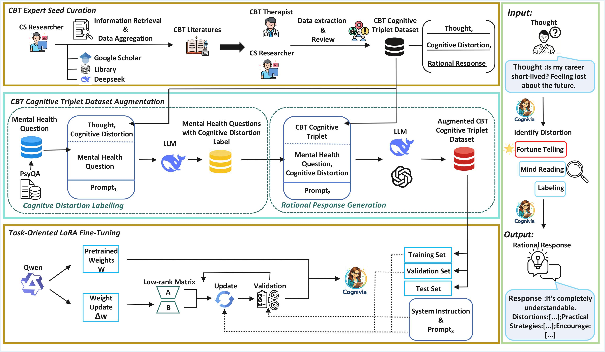

<p align="center">
  
</p>

💻 This is the official implementation of paper **Cognivia: An AI Therapist for Evidence-Based Cognitive Behavioral Therapy**.

**Cognivia** (or **“可薇”** in Chinese) is an evidence-based artificial intelligence therapist for cognitive behavioral therapy (CBT) that integrates automatic cognitive distortion identification and rational response generation.

## :fire: News
* **[2026.02.01]** We release github repository of **Cognivia**. 💪 Have a try！

## 🧭 Framework Overview

    <p><em>Figure 1:  The overall framework of Cognivia.</em></p >
The pipeline of our model is shown in Fig. 1, which consists of three stages: 
- **(1) CBT Expert Seed Curation**: Curate CBT literatures to form high quality [*CBT Cognitive Triplet Dataset*](https://github.com/paper2026-aaa/cognivia-anonymous/blob/main/data/CBT_Cognitive_Triplet_Dataset.xlsx) as reference seed.
- **(2) CBT Cognitive Triplet Dataset Augmentation**: Multi-stage prompting and structured generation to augment mental health questions from PsyQA dataset to generate
*Augmented CBT Cognitive Triplet Dataset*.
- **(3) Task-oriented LoRA Fine-tuning**: Fine-tuning large language models by *Augmented CBT Cognitive Triplet Dataset* to obtain **Cognivia** for cognitive distortion identification and rational response generation.


## 📊 Dataset Preparation
1. [**CBT Cognitive Triplet Dataset**](https://github.com/paper2026-aaa/cognivia-anonymous/blob/main/data/CBT_Cognitive_Triplet_Dataset.xlsx): 
Our work is based on authoritative texts that are widely regarded as core paradigms and standard
references in CBT.
Using these resources, we curate a high-quality seed cognitive triplet dataset of representative CBT question–answer pairs
and corresponding rational response.
The seed dataset is constructed based on established theoretical frameworks and clinical guidelines,
which is why we refer to our approach as **evidence-based**.
The form of this *CBT Cognitive Triplet Dataset*:

```jsonl
{"Thought": "...", "Cognitive Distortion": "...", "Rational Response": "..."}
```

2. **Augmented CBT Cognitive Triplet Dataset**:
This dataset is based on [**PsyQA**](https://github.com/thu-coai/PsyQA), 
a large-scale psychological question-answering dataset collected from publicly accessible
online mental health forums. PsyQA consists of anonymized user-generated question–answer pairs
related to psychological concerns as the following form:

```jsonl
{"Question": "...", "Answer": "..."}

```
⚠️ Note that, the original PsyQA dataset cannot be directly redistributed due to its usage policy.
To ensure compliance, we provide the complete pipeline for constructing the Augmented CBT Cognitive Triplet Dataset from the original data.
Users need to apply for the official certificate and downloading the PsyQA dataset from its original source before running our preprocessing scripts.

For each question **𝑞𝑖** in PsyQA, we employ the DeepSeek and GPT-5 Mini with two-stage data preprocessing to construct the Augmented CBT Cognitive Triplet Dataset with 9,437 samples:

- #### Stage 1: Cognitive Distortion Identification
From the original PsyQA dataset (~22K samples), we selected 9,437 question samples exhibiting cognitive distortions through a designed prompt-based filtering process.
We use an expert-designed *prompt_1* to identify the corresponding cognitive distortion **𝑑𝑖**.

Model: DeepSeek

Prompt: [filter_prompt.txt](prompts/filter_prompt.txt) (Prompt1 Version 2)​

Script: [identify_distortion.py](src/identify_distortion.py)

- #### Stage 2: Rational Response Generation
We use GPT-5 Mini with *prompt_2* to generate a corresponding rational response **𝑟𝑖**.

Model: GPT-5 Mini

Prompt: [response_prompt.txt](prompts/response_prompt.txt) (Prompt2 Version 3)

Script: [generate_response.py](src/generate_response.py)

The form of this *Augmented CBT Cognitive Triplet Dataset*:

```jsonl
{"Thought": "...", "Cognitive Distortion": "...", "Rational Response": "..."}
```

### ✨ Code Structure
The code structure and corresponding comments of this repository are as follows:

```
Cognivia/
├── Cognivia.py                 # Main entry script for running Cognivia
├── prompts
│   ├── filter_prompt.txt       # Prompt_1 of CBT Cognitive Triplet Dataset Augmentation (Cognitive Distortion Labelling)
│   └── response_prompt.txt     # Prompt_2 of CBT Cognitive Triplet Dataset Augmentation (Rational Response Generation)
│
├── data/                       
│   └── CBT_Cognitive_Triplet_Dataset.xlsx # CBT Cognitive Triplet Dataset curated from CBT Literatures
│
├── src/                      
│   ├── evaluation_with_8_dimensions.py    # Custom 8-dimension quality evaluation
│   ├── evaluation_with_NLP.py   # NLP-based evaluation methods
│   ├── fine-tuned_model_generate.py       # Generate responses using fine-tuned model
│   ├── identify_distortion.py   # Identify cognitive distortions
│   ├── generate_response.py     # Generate rational responses
│
├── materials/                  # Figures & assets for the paper
├── README.md                   # Project introduction and usage
├── LICENCE.txt                 # Licence information
└── requirements.txt            # Python dependencies
```

## 🚀 Quickstart

### 0) Install
```bash
git clone https://github.com/paper2026-aaa/cognivia-anonymous.git

cd Cognivia
pip install -r requirements.txt
```
### 1) Modify Tokens
To use your own OpenAI, DeepSeek, or SiliconFlow API tokens, replace the placeholders with your actual tokens. The relevant sections in the code have been left blank for this purpose.
```bash
# Replace with your OpenAI API token
api_key = "your_openai_api"
# Replace with your DeepSeek API token
api_key = "your_deepseek_api"
# Replace with your SiliconFlow API token
api_key = "your_siliconflow_api"
```
### 3) Augment Dataset
The relevant sections in the code have been left blank to ensure the correct path is used.
```bash
# Replace with your path to the preprocessed dataset.
psyqa_path = os.path.join(current_dir, "questions.xlsx")
```
Once the paths and tokens have been updated, run this file to get Augmented CBT Cognitive Triplet Dataset :
```bash
identify_distortion.py && generate_response.py
```
To meet the training requirements of the model, we transformed the data in the Augmented CBT Cognitive Triplet Dataset into the following format:
```jsonl
{"user": "...", "assistant": "..."}
```
### 6）Train
We fine-tuned Qwen2.5-7B-Instruct using LoRA on SiliconFlow.
The model is accessible via API with ID [**ft:LoRA/Qwen/Qwen2.5-7B-Instruct:d50jhbk50mis73di8n5g:gpt5_mini:udjarjexxlodpjueztat-ckpt_step_625**].
You can try it out with the code I've included below.
```bash
from openai import OpenAI

# Replace with your SiliconFlow API token
api_key = "your_siliconflow_api"

client = OpenAI(
    api_key=api_key,
    base_url="https://api.siliconflow.cn/v1"
)

FINE_TUNED_MODEL_ID = "ft:LoRA/Qwen/Qwen2.5-7B-Instruct:d50jhbk50mis73di8n5g:gpt5_mini:udjarjexxlodpjueztat-ckpt_step_62"
# Replace with your question
test_user_input = ("Is my career short-lived? Feeling lost about the future.")

response = client.chat.completions.create(
    model=FINE_TUNED_MODEL_ID,
    messages=[
        {
            "role": "system",
            "content": """You are a cognitive behavioral therapy (CBT) psychologist.
                          First, identify the type of cognitive distortion exhibited in the statement,
                          and then provide a response containing the following five paragraphs, separated by blank lines:
                          1.Empathy and Validation
                          2.Cognitive Distortion Analysis
                          3.Reflective Questions 
                          4.CBT Exercise Recommendation 
                          5.Encouragement and Next Steps.
                          If it does not contain a cognitive distortion (e.g., casual conversation, general questions, or statements without distortions),
                          switch to a natural, supportive conversation mode. Respond in a warm, counselor-like tone without analyzing distortions or following the five-paragraph structure.
                       """
        },
        {
            "role": "user",
            "content": test_user_input
        }
    ],
    temperature=0.2,
    max_tokens=300
)

print("\n--- Model Analysis Results ---\n")
print(response.choices[0].message.content)
```
### 5) Evaluation
The relevant sections in the code have been left blank to ensure the correct path is used.
```bash
# Replace with your path to test dataset
INPUT_FILE = os.path.join(current_dir, "test.xlsx")
file2_path = os.path.join(current_dir, "test.xlsx")
```
Our work shows that Cognivia performs particularly well on CBT tasks, you can use the following for evaluation.
```bash
fine-tuned_model_generate.py && (evaluation_with_NLP.py & evaluation_with_8_dimensions.py &)
```
